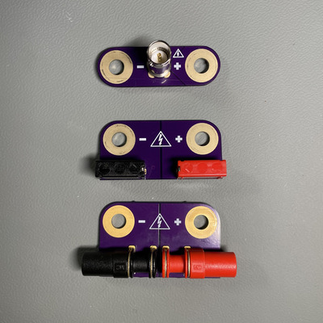
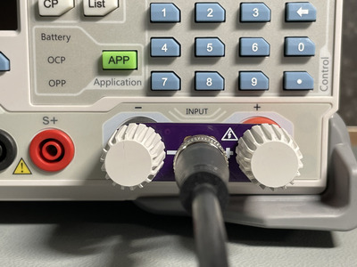
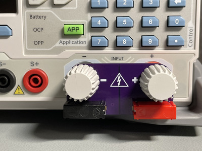
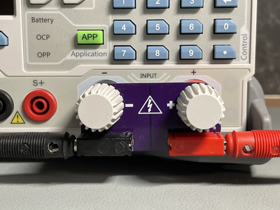
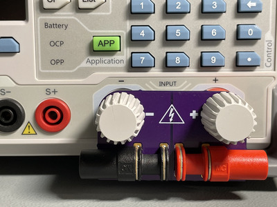
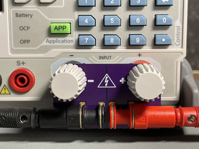

# Banana Jack and BNC Adapters for RIGOL DL3000 Electronic Loads

## Overview

This project is about banana jack and BNC adapters for RIGOL's DL3000 series
electronic loads. There are already adapters for narrower binding posts (like
BK Precision, ...) but I did not find any for the 39 mm pitch of the RIGOL
DL3000 series.

These adapters are meant for conveniently feeding a few amperes - not for high
current applications.

## Variants and Bills of Material

### BNC Adapter

The BNC adapter has a pretty standard footprint. So you should be able to find
a suitable replacement from your preferred distributor. Information on
replacement parts welcome.

* 1 PCB
    * KiCad design files form this repository
    * [Gerber and drill files](orders/dl3000-bnc-adapter-1.0-85dbc15.zip)
    * [Or just order it from OSH Park](https://oshpark.com/shared\_projects/MOcX6Gow)
* 1 [BNC connector](https://www.reichelt.de/steckverbinder-bnc-75-ohm-gerade-rnd-205-00437-p194660.html)

### Banana Jack Adapters

There are two board variants for sourcing the connectors from different
distributors.

#### PB4 Banana Jack Adapter

* 1 PCB
    * KiCad design files from this repository
    * [Gerber an drill files](orders/dl3000-banana-adapter-1.0-85dbc15.zip)
    * [Or just order it from OSH Park](https://oshpark.com/shared\_projects/gLsNtQ88)
* 1 connector Hirschmann Test and Measurement
  [PB4 red](https://www.reichelt.de/leiterplattenbuchse-4-mm-rot-pb-4-rt-p76865.html)
* 1 connector Hirschmann Test and Measurement
  [PB4 black](https://www.reichelt.de/leiterplattenbuchse-4-mm-schwarz-pb-4-sw-p13998.html)

#### 73099 Banana Jack Adapter

* 1 PCB
    * KiCad design files form this repository
    * [Gerber and drill files](orders/dl3000-banana-adapter-73099-1.1-8dd8051.zip)
    * [Or just order it from OSH Park](https://oshpark.com/shared_projects/TMnpJrJW)
* 1 connector Pomona [73099
  red](https://www.digikey.com/en/products/detail/pomona-electronics/73099-2/10483465)
* 1 connector Pomona [73099
  black](https://www.digikey.com/en/products/detail/pomona-electronics/73099-0/10483460)
